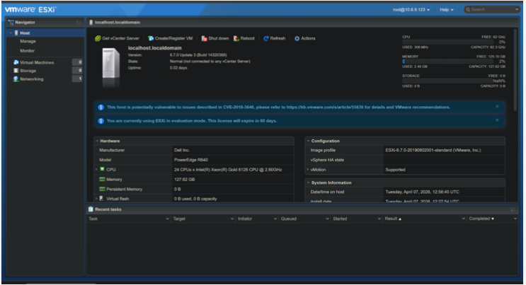

# Virtualization Lab – ESXi & Virtual Machines

## 📌 Overview
This project demonstrates hands-on experience with virtualization and server deployment using ESXi and VirtualBox. The lab simulates real-world data center environments by installing and managing multiple operating systems and virtual machines.

---

## 🔧 Labs Completed

### Virtual Machine Deployment (VirtualBox)

- Installed Windows 10, Windows Server 2019, and Ubuntu Linux in virtual environments
- Configured CPU, RAM, and storage resources for each virtual machine
- Verified successful OS installation and system functionality
  
    ## 📸 Screenshots
 

---

### ESXi Hypervisor Installation

- Installed ESXi hypervisor on a physical server
- Configured initial network settings for remote access
- Connected to and managed the ESXi host through its interface

    ## 📸 Screenshots
 

---

### Storage & Virtual Machine Setup (ESXi)

- Added and configured storage on the ESXi host
- Created and deployed virtual machines within ESXi
- Allocated system resources and tested VM performance

---

## 🛠 Tools & Technologies

- ESXi Hypervisor
- VirtualBox
- Windows 10 / Windows Server 2019 / Ubuntu Linux

---

## 💡 Key Skills Gained

- Virtual machine deployment and management
- Hypervisor installation and configuration
- Troubleshooting virtual systems

---

